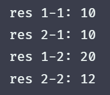

# Promise

> 本文不会涉及详细的赘述，仅根据具体效果划分步骤。
> 如果想看更加详细的解析，可以查看我的另一篇文章 [Promise使用详解及手写](https://blog.csdn.net/qq_53109172/article/details/130781768)

## Promise 主体

### 初始化
Promise 具备三种状态。`PENDING` `FULFILLED` `REJECTED`，因此我们可以提前将三种状态作为常量进行定义。如下：
```js
const PENDING = 'pending'
const FULFILLED = 'fulfilled'
const REJECTED = 'rejected'
```

在使用 Promise 的时候，实例化时需要传递一个回调函数，这个回调函数会立即执行，因此根据这个效果可知，我们写的 Promise 需要接受一个回调函数，且实例化时立即执行，这里采用 class 实现，如下：
```js
class MyPromise {
    // 接受一个回调函数参数，立即执行
    constructor(exec) {
        exec()
    }
}
const p = new MyPromise(() => {
    console.log('MyPromise 执行')
})
```
### 实现 resolve reject
在 Promise 中，如果状态成功，则调用 resolve 反之则调用 reject，因此传入的 exec 函数还需要增加两个状态函数，如下：
```js{8,12}
class MyPromise {
    constructor(exec) {
        const resolve = res => {} // [!code ++]

        const reject = err => {} // [!code ++]

        // 创建状态函数并传入，在外部使用时可以调用
        exec(resolve, reject)
    }
}

const p = new MyPromise((resolve, reject) => {
    console.log('MyPromise 执行')
})
```
这两个函数一旦调用则表示状态进行了改变，且无论什么状态都会存在一个返回值，因此这两个函数需要做的事情就是改变状态，且更新返回的结果，如下：
```js
class MyPromise {
    #status = PENDING
    #result = undefined
    constructor(exec) {
        // 功能重合，进行封装
        const changeStatus = (status, result) => {
            // 状态一旦改变则无法改变，做一个边界处理
            if (this.#status !== PENDING) return
            this.#status = status
            this.#result = result
        }

        const resolve = res => {
            changeStatus(FULFILLED, res)
        }

        const reject = err => {
            changeStatus(REJECTED, err)
        }

        exec(resolve, reject)
    }
}

const p = new MyPromise((resolve, reject) => {
    resolve(100)
})
```

### 实现 then 方法
在 Promise 中，最核心的方法就是 then 方法，then 方法接收两个参数，一个成功的回调，一个失败的回调，且 then 方法会返回一个 Promise，then 函数签名如下：
```js
class MyPromise {
    // ... 省略其他代码

    then(resolveFn, rejectFn) {
        return new MyPromise((resolve, reject) => {})
    }
}
```
函数签名实现之后，我们需要实现根据当前 Promise 的状态来执行不同的回调函数，如下：
```js
class MyPromise {
    // ... 省略其他代码

    then(resolveFn, rejectFn) {
        // 根据状态得到需要执行的函数
        const func = this.#status === FULFILLED ? resolveFn : rejectFn
        // 执行函数，并传入结果
        func(this.#result)

        return new MyPromise((resolve, reject) => {})
    }
}

const p = new MyPromise((resolve, reject) => {
    resolve(100)
})

p.then(
    res => {
        console.log('res', res)
    },
    err => {
        console.log('err', err)
    }
)
```
此时，就可以根据状态来执行不同的状态函数，但是失败的状态除了 reject 方法来确定之外，执行的过程如果发生错误，也需要设置为失败的状态，如下：
```js
class MyPromise {
    #status = PENDING
    #result = undefined
    constructor(exec) {
        // ...

        // 使用 try catch 来捕获错误
        try {
            exec(resolve, reject)
        } catch (error) {
            // 发生错误则主动调用 reject
            reject(error)
        }
    }

    // ...
}
```

### then - 解决异步设置状态
而此时是存在一个问题，目前所有的状态确定都是处于同步状态的，如果是异步的，那么 then 方法会因为状态为 pending 而不执行相对应的状态函数，因此需要再状态改变时来执行，改造如下：
```js{31-38,42-46}
class MyPromise {
    #status = PENDING
    #result = undefined
    #handle = null
    constructor(exec) {
        const changeStatus = (status, result) => {
            if (this.#status !== PENDING) return
            this.#status = status
            this.#result = result

            // 状态改变时，则调用 run 方法
            this.#run() // [!code ++]
        }

        const resolve = res => {
            changeStatus(FULFILLED, res)
        }

        const reject = err => {
            changeStatus(REJECTED, err)
        }

        try {
            exec(resolve, reject)
        } catch (error) {
            reject(error)
        }
    }

    // 执行单独提取为一个函数
    #run() {
        // 如果处于pending或者没有可执行的函数，则不处理
        if (this.#status === PENDING || this.#handle === null) return
        const { resolve, reject } = this.#handle

        const func = this.#status === FULFILLED ? resolve : reject
        func(this.#result)
    }

    then(resolveFn, rejectFn) {
        // then 方法调用时，将要调用的状态函数存储起来，方便后续使用
        this.#handle = {
            resolve: resolveFn,
            reject: rejectFn
        }
        this.#run()

        return new MyPromise((resolve, reject) => {})
    }
}

const p = new MyPromise((resolve, reject) => {
    setTimeout(() => {
        resolve(100)
    }, 2000)
})

p.then(
    res => {
        console.log('res', res)
    },
    err => {
        console.log('err', err)
    }
)
```
### then - 实现回调进入微队列
众所周知，Promise 的 then 方法虽然是同步调用的，但是里面的回调需要进行异步调用，实现如下：
```js
class MyPromise {
    #status = PENDING
    #result = undefined
    #handle = null
    constructor(exec) {
        // ...
    }

    #run() {
        if (this.#status === PENDING || this.#handle === null) return
        const { resolve, reject } = this.#handle

        const func = this.#status === FULFILLED ? resolve : reject

        // 加入微任务执行
        this.#runMicroTask(() => {
            func(this.#result)
        })
    }

    // 将任务加入微队列执行
    #runMicroTask(fn) {
        // NODE 环境
        if (typeof process === 'object' && typeof process.nextTick === 'function') {
            process.nextTick(fn)
        }
        // 浏览器环境
        else if (typeof queueMicrotask === 'function') {
            queueMicrotask(fn)
        }
        // 其他情况
        else {
            setTimeout(fn, 0)
        }
    }

    then(resolveFn, rejectFn) {
        console.log('then 方法触发')

        this.#handle = {
            resolve: resolveFn,
            reject: rejectFn
        }
        this.#run()

        return new MyPromise((resolve, reject) => {})
    }
}

const p = new MyPromise((resolve, reject) => {
    resolve(100)
})

p.then(
    res => {
        console.log('res', res)
    },
    err => {
        console.log('err', err)
    }
)

console.log('同步输出 ---')
```
结果如图：


### then - 链式调用
then 方法可以返回一个 Promise，而这个 Promise 由上一次的 Promise 决定， 实现如下：
```js
class MyPromise {
    // ...

    #run() {
        if (this.#status === PENDING || this.#handle === null) return
        const { resolve, reject, nextResolve, nextReject } = this.#handle

        const func = this.#status === FULFILLED ? resolve : reject

        this.#runMicroTask(() => {
            try {
                // 得到上一个 promise 状态函数返回的结果，作为下一个 promise 状态接收的结果
                const result = func(this.#result)
                nextResolve(result)
            } catch (error) {
                // 如果上一个 then 方法的状态函数，执行过程出现错误则下一个状态函数也是失败的状态
                nextReject(error)
            }
        })
    }

    // ... #runMicroTask

    then(resolveFn, rejectFn) {
        return new MyPromise((resolve, reject) => {
            this.#handle = {
                resolve: resolveFn,
                reject: rejectFn,
                // 将 then 方法返回新 promise 的状态函数也进行存储
                nextResolve: resolve,
                nextReject: reject
            }
            this.#run()
        })
    }
}

const p = new MyPromise((resolve, reject) => {
    resolve(100)
})

p.then(res => {
    console.log('res 1-1:', res)
    return res * 2
}).then(res => {
    console.log('res 1-2:', res)
})
```
这是还有一个特殊情况就是，如果上一个 then 方法的状态函数如果返回值是一个 promise，则下个 promise 的状态由这个返回的 promise 来决定，因此我们需要一个函数来判断一个值是否是 promise，如下：
```js
function isPromise(value) {
    return typeof value === 'object' && typeof value.then === 'function'
}
```
将其加入到执行逻辑，如下：
```js
class MyPromise {
    // ...

    #run() {
        if (this.#status === PENDING || this.#handle === null) return
        const { resolve, reject, nextResolve, nextReject } = this.#handle

        const func = this.#status === FULFILLED ? resolve : reject

        this.#runMicroTask(() => {
            try {
                const result = func(this.#result)
                // 如果是 promise 的处理
                if (isPromise(result)) {
                    // 根据这个返回的 promise 的状态来确定
                    result.then(
                        res => {
                            nextResolve(res)
                        },
                        err => {
                            nextReject(err)
                        }
                    )
                } else {
                    nextResolve(result)
                }
            } catch (error) {
                nextReject(error)
            }
        })
    }

    // ... #runMicroTask、then
}
```


### then - 多次调用 then 方法
在使用 Promise 的时候，我们可以让一个 promise 实例多次调用 then 方法，来分别处理不同的逻辑，如下：
```js
const p = new Promise((resolve, reject) => {
    resolve(10)
})

// 第一次
p.then(res => {
    console.log('res 1-1:', res)
    return res * 2
}).then(res => {
    console.log('res 1-2:', res)
})

// 第二次
p.then(res => {
    console.log('res 2-1:', res)
    return res + 2
}).then(res => {
    console.log('res 2-2:', res)
})
```
输出结果如图：



目前我们的结果可以输出这个效果吗？目前完整代码如下：
:::details 完整代码
```js
function isPromise(value) {
    return typeof value === 'object' && typeof value.then === 'function'
}

const PENDING = 'pending'
const FULFILLED = 'fulfilled'
const REJECTED = 'rejected'

class MyPromise {
    #status = PENDING
    #result = undefined
    #handle = null
    constructor(exec) {
        const changeStatus = (status, result) => {
            if (this.#status !== PENDING) return
            this.#status = status
            this.#result = result

            this.#run()
        }

        const resolve = res => {
            changeStatus(FULFILLED, res)
        }

        const reject = err => {
            changeStatus(REJECTED, err)
        }

        try {
            exec(resolve, reject)
        } catch (error) {
            reject(error)
        }
    }

    #run() {
        if (this.#status === PENDING || this.#handle === null) return
        const { resolve, reject, nextResolve, nextReject } = this.#handle

        const func = this.#status === FULFILLED ? resolve : reject

        this.#runMicroTask(() => {
            try {
                const result = func(this.#result)
                if (isPromise(result)) {
                    result.then(
                        res => {
                            nextResolve(res)
                        },
                        err => {
                            nextReject(err)
                        }
                    )
                } else {
                    nextResolve(result)
                }
            } catch (error) {
                nextReject(error)
            }
        })
    }

    #runMicroTask(fn) {
        if (typeof process === 'object' && typeof process.nextTick === 'function') {
            process.nextTick(fn)
        } else if (typeof queueMicrotask === 'function') {
            queueMicrotask(fn)
        } else {
            setTimeout(fn, 0)
        }
    }

    then(resolveFn, rejectFn) {
        return new MyPromise((resolve, reject) => {
            this.#handle = {
                resolve: resolveFn,
                reject: rejectFn,
                nextResolve: resolve,
                nextReject: reject
            }
            this.#run()
        })
    }
}

const p = new MyPromise((resolve, reject) => {
    resolve(10)
})

// 第一次
p.then(res => {
    console.log('res 1-1:', res)
    return res * 2
}).then(res => {
    console.log('res 1-2:', res)
})

// 第二次
p.then(res => {
    console.log('res 2-1:', res)
    return res + 2
}).then(res => {
    console.log('res 2-2:', res)
})
```
:::
结果如图：


可以看到，结果是一样的，那如果是异步确定状态呢，如下：
```js
const p = new MyPromise((resolve, reject) => {
    setTimeout(() => {
        console.log('setTimeout 执行')
        resolve(10)
    }, 2000)
})
```
结果如图：


现在就完全不一致了，这是因为同步时，then 方法返回一个 Promise 的时候，也会立马调用 run 方法，此时会提前吧需要调用的状态函数进行提取，而实际执行是在微任务队列执行，就会产生闭包，导致出现了正确的输出，如图：


因此如果想在异步确定状态时也可以正确输出，需要进行改动，改为数组结构，如下：
```js
class MyPromise {
    #status = PENDING
    #result = undefined
    #handles = []
    constructor(exec) {
        // ...
    }

    #run() {
        if (this.#status === PENDING || this.#handles.length === 0) return

        this.#runMicroTask(() => {
            while (this.#handles.length) {
                // 截取对应的状态函数
                const handle = this.#handles.shift()
                const { resolve, reject, nextResolve, nextReject } = handle

                const func = this.#status === FULFILLED ? resolve : reject

                try {
                    const result = func(this.#result)
                    // 如果是 promise 的处理
                    if (isPromise(result)) {
                        // 根据这个返回的 promise 的状态来确定
                        result.then(
                            res => {
                                nextResolve(res)
                            },
                            err => {
                                nextReject(err)
                            }
                        )
                    } else {
                        nextResolve(result)
                    }
                } catch (error) {
                    nextReject(error)
                }
            }
        })
    }

    #runMicroTask(fn) {
        if (typeof process === 'object' && typeof process.nextTick === 'function') {
            process.nextTick(fn)
        } else if (typeof queueMicrotask === 'function') {
            queueMicrotask(fn)
        } else {
            setTimeout(fn, 0)
        }
    }

    then(resolveFn, rejectFn) {
        return new MyPromise((resolve, reject) => {
            // 更该存储方式
            this.#handles.push({
                resolve: resolveFn,
                reject: rejectFn,
                nextResolve: resolve,
                nextReject: reject
            })
            this.#run()
        })
    }
}

const p = new MyPromise((resolve, reject) => {
    setTimeout(() => {
        console.log('setTimeout 执行')
        resolve(10)
    }, 2000)
})
```
现在输出结果如图：


至此 Promise 就已经手写完成了，剩余的 API 都是基于此基础上进行的扩展。

## 完整代码 - 不包含扩展 API
```js
function isPromise(value) {
    return typeof value === 'object' && typeof value.then === 'function'
}

const PENDING = 'pending'
const FULFILLED = 'fulfilled'
const REJECTED = 'rejected'

class MyPromise {
    #status = PENDING
    #result = undefined
    #handles = []
    constructor(exec) {
        const changeStatus = (status, result) => {
            if (this.#status !== PENDING) return
            this.#status = status
            this.#result = result

            this.#run()
        }

        const resolve = res => {
            changeStatus(FULFILLED, res)
        }

        const reject = err => {
            changeStatus(REJECTED, err)
        }

        try {
            exec(resolve, reject)
        } catch (error) {
            reject(error)
        }
    }

    #run() {
        if (this.#status === PENDING || this.#handles.length === 0) return

        this.#runMicroTask(() => {
            while (this.#handles.length) {
                const handle = this.#handles.shift()
                const { resolve, reject, nextResolve, nextReject } = handle

                const func = this.#status === FULFILLED ? resolve : reject

                try {
                    const result = func(this.#result)
                    if (isPromise(result)) {
                        result.then(
                            res => {
                                nextResolve(res)
                            },
                            err => {
                                nextReject(err)
                            }
                        )
                    } else {
                        nextResolve(result)
                    }
                } catch (error) {
                    nextReject(error)
                }
            }
        })
    }

    #runMicroTask(fn) {
        if (typeof process === 'object' && typeof process.nextTick === 'function') {
            process.nextTick(fn)
        } else if (typeof queueMicrotask === 'function') {
            queueMicrotask(fn)
        } else {
            setTimeout(fn, 0)
        }
    }

    then(resolveFn, rejectFn) {
        return new MyPromise((resolve, reject) => {
            this.#handles.push({
                resolve: resolveFn,
                reject: rejectFn,
                nextResolve: resolve,
                nextReject: reject
            })
            this.#run()
        })
    }
}
```